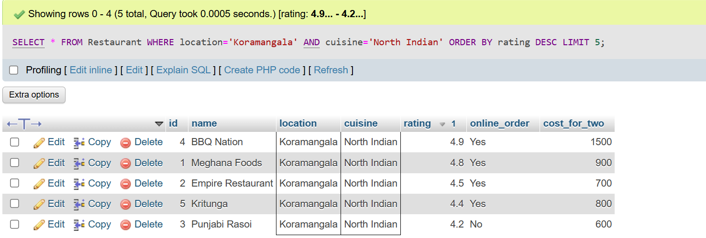
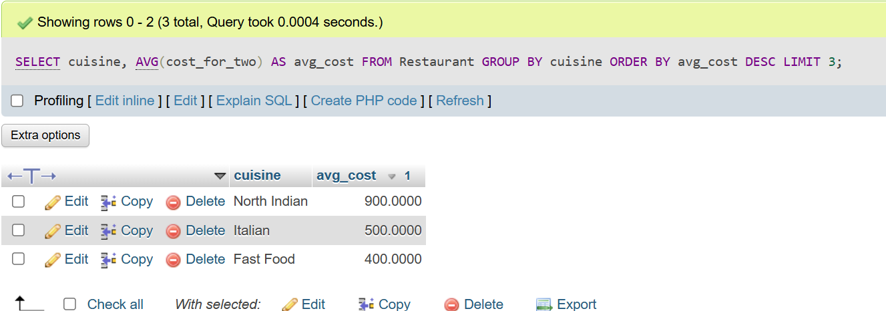
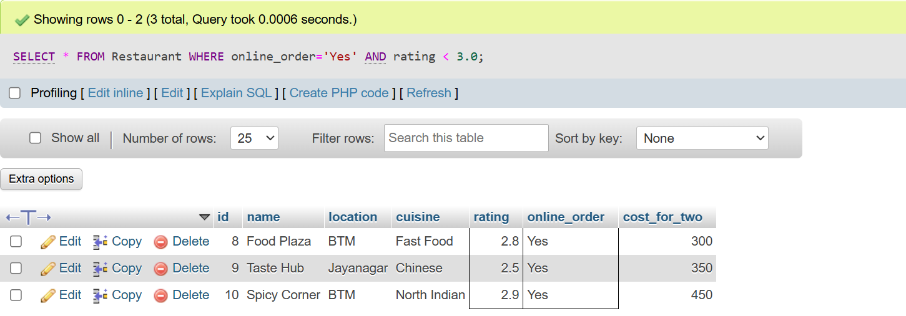
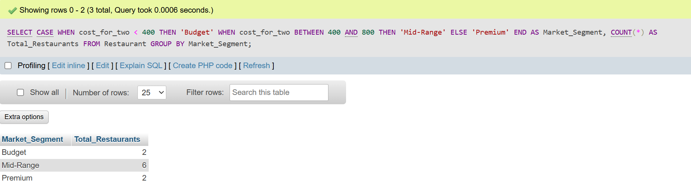
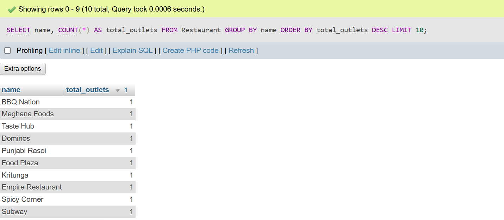

## <center><h1> CASE STUDY </h1></center>

# TASK - 1 : 1. Write an SQL query to find the top 5 highest-rated restaurants in Koramangala that serve North Indian cuisine, using the Zomato Bangalore dataset.

```
CREATE TABLE Restaurant (
    id INT PRIMARY KEY,
    name VARCHAR(100),
    location VARCHAR(100),
    cuisine VARCHAR(100),
    rating DECIMAL(2,1),
    online_order VARCHAR(10),
    cost_for_two INT
);

INSERT INTO Restaurant VALUES (1,'Meghana Foods','Koramangala','North Indian',4.8,'Yes',900), (2,'Empire Restaurant','Koramangala','North Indian',4.5,'Yes',700), (3,'Punjabi Rasoi','Koramangala','North Indian',4.2,'No',600), (4,'BBQ Nation','Koramangala','North Indian',4.9,'Yes',1500), (5,'Kritunga','Koramangala','North Indian',4.4,'Yes',800), (6,'Dominos','Indiranagar','Italian',4.0,'Yes',500), (7,'Subway','HSR Layout','Fast Food',3.7,'Yes',400);

SELECT * FROM Restaurant WHERE location='Koramangala' AND cuisine='North Indian' ORDER BY rating DESC LIMIT 5;
```


# TASK - 2:Using SQL, calculate the average cost for two people for each cuisine type and list the 3 most expensive cuisines to eat in Bangalore.

```
SELECT cuisine, AVG(cost_for_two) AS avg_cost FROM Restaurant GROUP BY cuisine ORDER BY avg_cost DESC LIMIT 3;
```


# TASK - 3 :Find all restaurants that offer online delivery but have a rating below 3.0, and suggest a marketing strategy to improve their ratings based on your findings.<br><br><em><strong>Hint:</strong> Look for patterns in location, cuisine, or price that might explain the low ratings.</em>

```
INSERT INTO Restaurant VALUES (8,'Food Plaza','BTM','Fast Food',2.8,'Yes',300), (9,'Taste Hub','Jayanagar','Chinese',2.5,'Yes',350), (10,'Spicy Corner','BTM','North Indian',2.9,'Yes',450);

SELECT * FROM Restaurant WHERE online_order='Yes' AND rating < 3.0;
```


# TASK - 4 :Write an SQL query to segment restaurants into three market segments based on average cost for two: budget (below 400), mid-range (400-800), and premium (above 800). Count how many restaurants fall into each segment.

```
SELECT CASE WHEN cost_for_two < 400 THEN 'Budget' WHEN cost_for_two BETWEEN 400 AND 800 THEN 'Mid-Range' ELSE 'Premium' END AS Market_Segment, COUNT(*) AS Total_Restaurants FROM Restaurant GROUP BY Market_Segment;
```


# TASK - 5 : Use ChatGPT or Copilot to help you write an SQL query that lists the top 10 most popular restaurant chains (by number of outlets) in the dataset, then run and validate the query yourself.<br><br><em><strong>Hint:</strong> Search for 'SQL group by count example' if you get stuck.</em>

```
SELECT name, COUNT(*) AS total_outlets FROM Restaurant GROUP BY name ORDER BY total_outlets DESC LIMIT 10;
```
