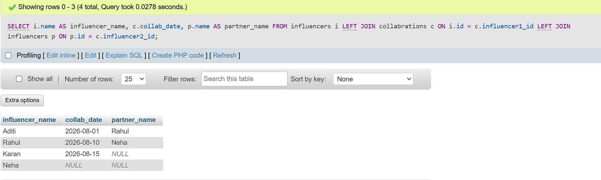
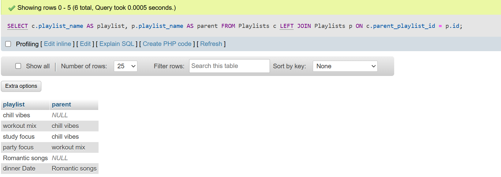
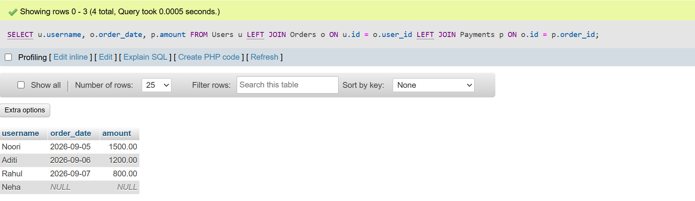
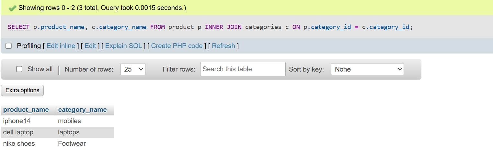
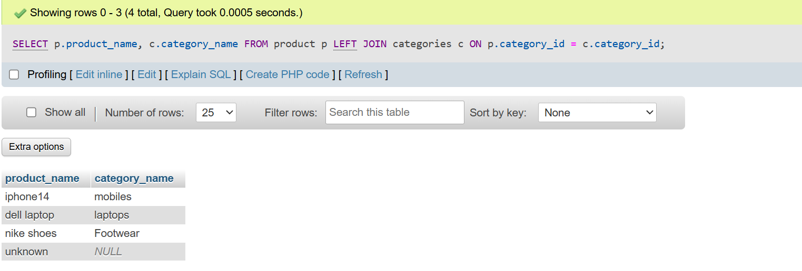

# <center><h1> SESSION - 10 : JOINS - PART - 2 </h1></center> 

## TASK - 1 : Create two tables: Influencers (id, name) and Collaborations (id, influencer1_id, influencer2_id, collab_date). Write a SQL FULL JOIN query to list all influencers and show their collaboration partner names if any, including influencers with no collaborations.

```
create table influencers(
    id int AUTO_INCREMENT PRIMARY KEY,
    name varchar(50)
    );

create table collabrations (
    id int AUTO_INCREMENT PRIMARY KEY,
    influencer1_id int,
    influencer2_id int,
    collab_date date,
    FOREIGN KEY(influencer1_id)REFERENCES influencers(id),
    FOREIGN KEY(influencer2_id)REFERENCES influencers(id)
    );

INSERT INTO influencers (id, name) VALUES
(1, 'Aditi'),
(2, 'Rahul'),
(3, 'Neha'),
(4, 'Karan');

INSERT INTO collaborations (id, influencer1_id, influencer2_id, collab_date) VALUES
(1, 1, 2, '2026-08-01'),  
(2, 2, 3, '2026-08-10'),  
(3, 4, NULL, '2026-08-15');
```
<h2><b>Note</b> :- <u>Full Join is not Supported in MYSQL so we use union to get all data using Left Join & Right join.</u></h2>

```
    SELECT i.name AS influencer_name,
       c.collab_date,
       p.name AS partner_name
FROM influencers i
LEFT JOIN collabrations c
    ON i.id = c.influencer1_id
LEFT JOIN influencers p
    ON p.id = c.influencer2_id;
```


# TASK - 2 : Using a SELF JOIN, write a query on a table called Playlists (id, user_id, playlist_name, parent_playlist_id) to display each playlist alongside its parent playlist name, similar to how Spotify shows nested playlists.<br><br><em><strong>Hint:</strong> Join Playlists with itself on parent_playlist_id = id.</em>

```
create table playlists(
    id int AUTO_INCREMENT PRIMARY KEY,
    user_id int,
    playlist_name varchar(50),
    parent_playlist_id int );

INSERT INTO playlists(user_id,playlist_name,parent_playlist_id)VALUES(101,'chill vibes',null),(101,'workout mix',1),(101,'study focus',1),(101,'party focus',2),(101,'Romantic songs',null),(101,'dinner Date',5);

SELECT c.playlist_name AS playlist,
       p.playlist_name AS parent
FROM Playlists c
LEFT JOIN Playlists p
ON c.parent_playlist_id = p.id;
```


# TASK - 3 : Given three tables: Users (id, username), Orders (id, user_id, order_date), and Payments (id, order_id, amount), write a SQL query using multiple JOINs to display each username, their order date, and payment amount, showing all users even if they have no orders or payments.

```
CREATE TABLE Users (
    id INT PRIMARY KEY,
    username VARCHAR(50)
);

CREATE TABLE Orders (
    id INT PRIMARY KEY,
    user_id INT,
    order_date DATE,
    FOREIGN KEY (user_id) REFERENCES Users(id)
);

CREATE TABLE Payments (
    id INT PRIMARY KEY,
    order_id INT,
    amount DECIMAL(10,2),
    FOREIGN KEY (order_id) REFERENCES Orders(id)
);

INSERT INTO Users (id, username) VALUES
(1, 'Noori'),
(2, 'Aditi'),
(3, 'Rahul'),
(4, 'Neha');

INSERT INTO Orders (id, user_id, order_date) VALUES
(101, 1, '2026-09-05'),
(102, 2, '2026-09-06'),
(103, 3, '2026-09-07');

INSERT INTO Payments (id, order_id, amount) VALUES
(1001, 101, 1500.00),
(1002, 102, 1200.00),
(1003, 103, 800.00);

SELECT u.username,
       o.order_date,
       p.amount
FROM Users u
LEFT JOIN Orders o ON u.id = o.user_id
LEFT JOIN Payments p ON o.id = p.order_id;
```


# TASK - 4 : You notice that your JOIN query between Zomato's Restaurants and Reviews tables is returning duplicate rows for some restaurants. Modify your query to eliminate duplicates and explain in one line why the duplicates were happening.<br><br><em><strong>Hint:</strong> Use DISTINCT or GROUP BY and consider the relationship between restaurants and reviews.</em>

<h2><u>NORMAL JOIN QUERY ( DUPLICATE APPEARS )</u></h2>

```
SELECT r.name, rv.review_text
FROM Restaurants r
JOIN Reviews rv
ON r.id = rv.restaurant_id;
```
<h2><u>FIXED QUERY(REMOVE DUPLICATES)</u></h2>

```
SELECT DISTINCT r.name, rv.review_text
FROM Restaurants r
JOIN Reviews rv
ON r.id = rv.restaurant_id;
```
<h3><b>Duplicates happened because one restaurant has many reviews, so JOIN shows the restaurant again for each review.Using DISTINCT removes repeated rows, and GROUP BY shows each restaurant only once with summary data.</b></h3>

# TASK - 5 : Write two different JOIN queries on a Products and Categories table (like Flipkart) to list all products with their category names, but use different join conditions in each. Briefly explain which join condition is more efficient and why.

```
create table categories
 (
     category_id int PRIMARY KEY,
     category_name varchar(50)
     );

CREATE TABLE product(
    product_id int AUTO_INCREMENT PRIMARY KEY,
    product_name varchar(50),
    category_id INT,
     FOREIGN KEY (category_id) REFERENCES categories(category_id)
  );

INSERT INTO categories(`category_id`, `category_name`) VALUES (101,'mobiles'),(102,'laptops'),(103,'Footwear');

INSERT INTO product(`product_name`, `category_id`) VALUES ('iphone14',101),('dell laptop',102),('nike shoes',103);
```
<h2><u>INNER JOIN</u></h2>

```
SELECT p.product_name, c.category_name
FROM product p
INNER JOIN categories c
ON p.category_id = c.category_id;
```


<h2><u>LEFT JOIN</u></h2>

```
SELECT p.product_name, c.category_name
FROM product p
LEFT JOIN categories c
ON p.category_id = c.category_id;
```


- INNER JOIN is more efficient because it only returns matching rows. LEFT JOIN is useful when you also want to see products without a category (NULL values).