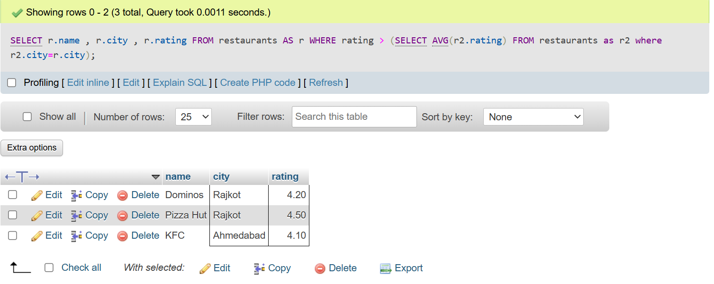
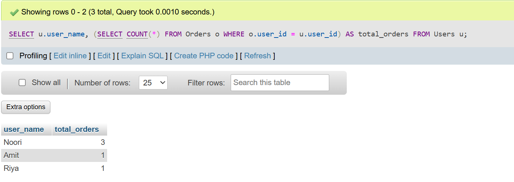
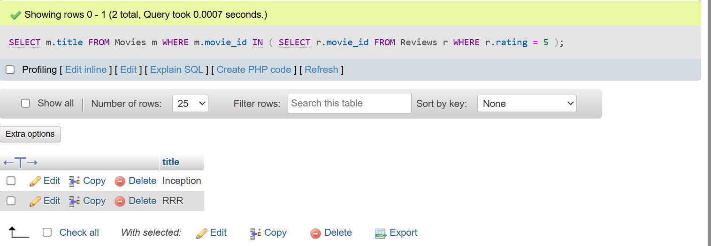
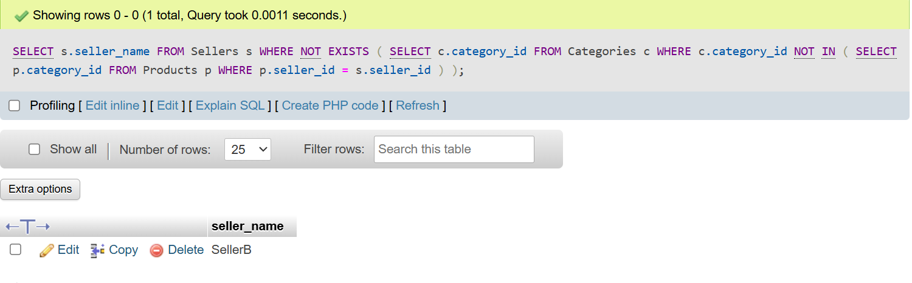

# <center><h1>SESSION - 11 : SUBQUERIES </h1></center>

# TASK - 1 :Create a SQL query using a subquery in the WHERE clause to find all restaurants from a 'Restaurants' table whose average rating is higher than the average rating of all restaurants in the city.

```
CREATE TABLE Restaurants (
    id INT PRIMARY KEY AUTO_INCREMENT,
    name VARCHAR(50),
    city VARCHAR(50),
    rating DECIMAL(3,2)
);

INSERT INTO Restaurants (name, city, rating) VALUES
('Dominos', 'Rajkot', 4.2),
('Subway', 'Rajkot', 3.8),
('Pizza Hut', 'Rajkot', 4.5),
('Burger King', 'Ahmedabad', 3.9),
('KFC', 'Ahmedabad', 4.1);

SELECT r.name, r.city, r.rating
FROM Restaurants r
WHERE r.rating > (
    SELECT AVG(r2.rating)
    FROM Restaurants r2
    WHERE r2.city = r.city
);
```


# TASK - 2 : Write a SQL query that uses a subquery in the SELECT statement to display each user's name from a 'Users' table along with the total number of orders they have placed from an 'Orders' table, like a summary you might see in a Zomato user profile.

```
CREATE TABLE Users (
    user_id INT PRIMARY KEY AUTO_INCREMENT,
    user_name VARCHAR(50)
);

CREATE TABLE Orders (
    order_id INT PRIMARY KEY AUTO_INCREMENT,
    user_id INT,
    FOREIGN KEY (user_id) REFERENCES Users(user_id)
);

INSERT INTO Users (user_name) VALUES
('Noori'), ('Amit'), ('Riya');


INSERT INTO Orders (user_id) VALUES
(1), (1), (2), (3), (1);

SELECT u.user_name,
       (SELECT COUNT(*)
        FROM Orders o
        WHERE o.user_id = u.user_id) AS total_orders
FROM Users u;
```
 

# TASK - 3 : Given a 'Movies' table and a 'Reviews' table, write a SQL query using IN with a subquery to list all movies that have at least one review with a rating of 5 stars, as seen in BookMyShow's top-rated section.

```
CREATE TABLE Movies (
    movie_id INT PRIMARY KEY AUTO_INCREMENT,
    title VARCHAR(50)
);

CREATE TABLE Reviews (
    review_id INT PRIMARY KEY AUTO_INCREMENT,
    movie_id INT,
    rating INT,
    FOREIGN KEY (movie_id) REFERENCES Movies(movie_id)
);

INSERT INTO Movies (title) VALUES
('Inception'), ('RRR'), ('Lagaan');

INSERT INTO Reviews (movie_id, rating) VALUES
(1, 5),   
(1, 4),   
(2, 5),   
(3, 3);   

SELECT m.title
FROM Movies m
WHERE m.movie_id IN (
    SELECT r.movie_id
    FROM Reviews r
    WHERE r.rating = 5
);
```


# TASK - 4 : Write a nested SQL query to find the names of all sellers from a 'Sellers' table on a Flipkart-style platform who have sold products in every category listed in a 'Categories' table.<br><br><em><strong>Hint:</strong> Use nested subqueries to compare seller's categories with the complete list of categories.</em>

```
CREATE TABLE Sellers (
    seller_id INT PRIMARY KEY AUTO_INCREMENT,
    seller_name VARCHAR(50)
);

CREATE TABLE Categories (
    category_id INT PRIMARY KEY,
    category_name VARCHAR(50)
);

CREATE TABLE Products (
    product_id INT PRIMARY KEY AUTO_INCREMENT,
    seller_id INT,
    category_id INT,
    FOREIGN KEY (seller_id) REFERENCES Sellers(seller_id),
    FOREIGN KEY (category_id) REFERENCES Categories(category_id)
);

INSERT INTO Sellers (seller_name) VALUES
('SellerA'), ('SellerB');

INSERT INTO Categories (category_id, category_name) VALUES
(101, 'Mobiles'),
(102, 'Laptops'),
(103, 'Footwear');

INSERT INTO Products (seller_id, category_id) VALUES
(1, 101), (1, 102),     
(2, 101), (2, 102), (2, 103); 

SELECT s.seller_name
FROM Sellers s
WHERE NOT EXISTS (
    SELECT c.category_id
    FROM Categories c
    WHERE c.category_id NOT IN (
        SELECT p.category_id
        FROM Products p
        WHERE p.seller_id = s.seller_id
    )
);

```
