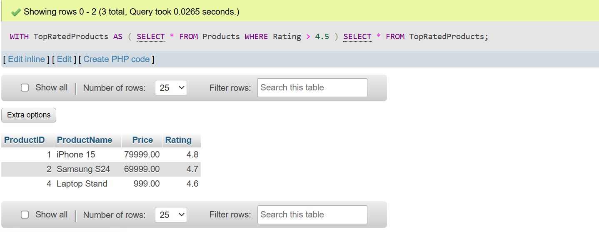
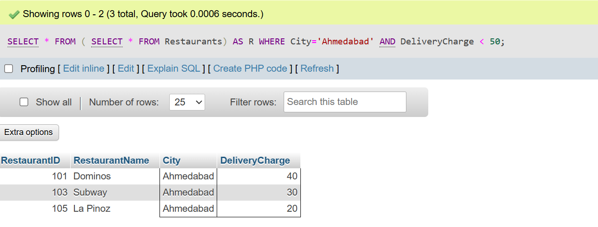
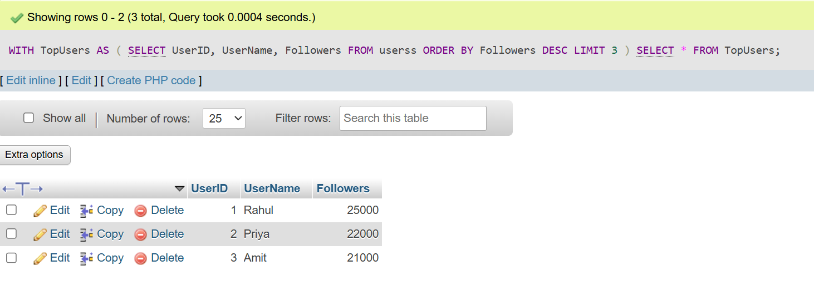
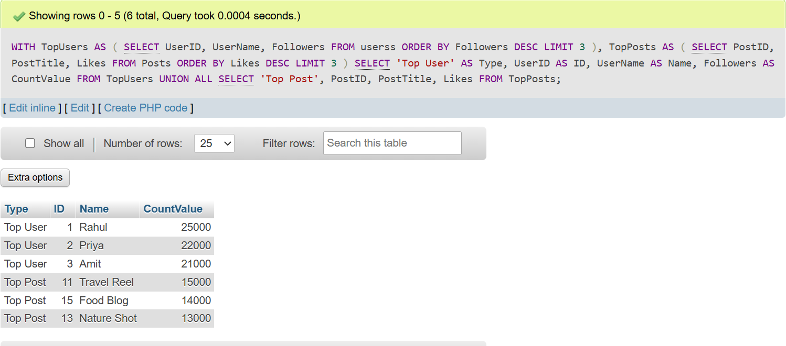
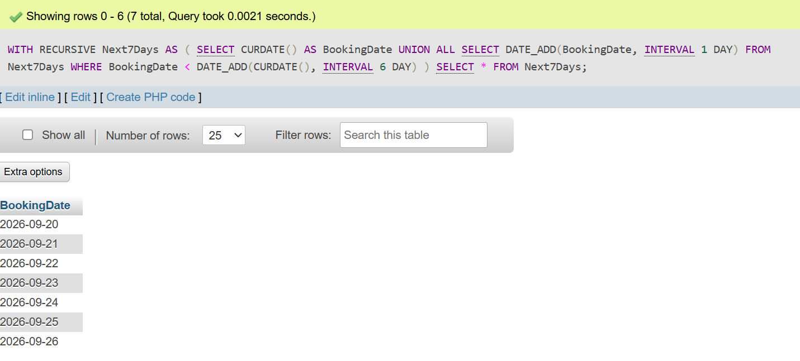
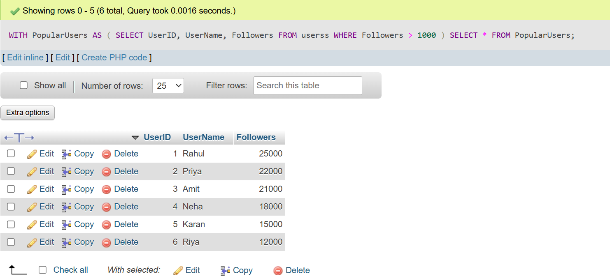

## <center><h1> SESSION - 12 : CTE (with clause) </h1></center>

# TASK - 1 :Create a CTE using the WITH clause to select all products with a rating above 4.5 from a 'Products' table, similar to how Flipkart or Myntra might highlight top-rated items.
```
CREATE TABLE Products (
    ProductID INT AUTO_INCREMENT PRIMARY KEY,
    ProductName VARCHAR(100),
    Price DECIMAL(10,2),
    Rating DECIMAL(2,1)
);

INSERT INTO Products VALUES
(1,'iPhone 15',79999,4.8),
(2,'Samsung S24',69999,4.7),
(3,'Boat Headphones',1999,4.3),
(4,'Laptop Stand',999,4.6),
(5,'Mouse',799,4.4);

WITH TopRatedProducts AS
(
    SELECT *
    FROM Products
    WHERE Rating > 4.5
)
SELECT *
FROM TopRatedProducts;
```


## TASK - 2 : Rewrite a query that finds all restaurants in 'Ahmedabad' with delivery charges under 50 from a 'Restaurants' table, first using a subquery and then using a CTE. Compare both queries for readability.<br><br><em><strong>Hint:</strong> Focus on making the CTE version cleaner and easier to understand.</em>

```
    CREATE TABLE Restaurants (
    RestaurantID INT  AUTO_INCREMENT PRIMARY KEY,
    RestaurantName VARCHAR(100),
    City VARCHAR(50),
    DeliveryCharge INT
    );

    INSERT INTO Restaurants VALUES
    (101,'Dominos','Ahmedabad',40),
    (102,'Pizza Hut','Ahmedabad',60),
    (103,'Subway','Ahmedabad',30),
    (104,'McDonalds','Rajkot',45),
    (105,'La Pinoz','Ahmedabad',20);
```

<h2>USING SUBQUERY</h2>

```
    SELECT * FROM ( SELECT * FROM Restaurants) AS R WHERE City='Ahmedabad' AND DeliveryCharge < 50;
```
<h2>USING  CTE</h2>

```
    WITH AhmedabadRestaurants AS ( SELECT * FROM Restaurants WHERE City='Ahmedabad')SELECT * FROM AhmedabadRestaurants WHERE DeliveryCharge < 50;
```



## TASK- 3 :Using two CTEs in a single query, find the top 3 most-followed users and the top 3 most-liked posts from a 'Users' and 'Posts' table (think Instagram-style data). Output both lists in the same result set.

```
CREATE TABLE Userss (
    UserID INT PRIMARY KEY,
    UserName VARCHAR(50),
    Followers INT
);

INSERT INTO Userss VALUES
(1,'Rahul',25000),
(2,'Priya',22000),
(3,'Amit',21000),
(4,'Neha',18000),
(5,'Karan',15000),
(6,'Riya',12000);

CREATE TABLE Postss (
    PostID INT PRIMARY KEY,
    PostTitle VARCHAR(100),
    Likes INT
);

INSERT INTO Postss VALUES
(101,'Travel Reel',15000),
(102,'Food Blog',14000),
(103,'Nature Shot',13000),
(104,'Tech Review',10000),
(105,'Funny Meme',9000),
(106,'Gaming Clip',8000);

WITH TopUsers AS
(
    SELECT UserID,
           UserName,
           Followers
    FROM Users
    ORDER BY Followers DESC
    LIMIT 3
)
SELECT *
FROM TopUsers;
```


<h2> two CTE IN ONE QUERY :- </h2>

```
    WITH TopUsers AS
(
    SELECT UserID,
           UserName,
           Followers
    FROM Userss
    ORDER BY Followers DESC
    LIMIT 3
),

TopPosts AS
(
    SELECT PostID,
           PostTitle,
           Likes
    FROM Postss
    ORDER BY Likes DESC
    LIMIT 3
)

SELECT
'Top User' AS Type,
UserID AS ID,
UserName AS Name,
Followers AS CountValue
FROM TopUsers

UNION ALL

SELECT
'Top Post',
PostID,
PostTitle,
Likes
FROM TopPosts;
```


## TASK - 4 :Write a recursive CTE that generates a list of dates for the next 7 days starting from today, similar to how BookMyShow shows available dates for movie bookings.<br><br><em><strong>Hint:</strong> Use a base case for today and recursion to add one day at a time.</em>

```
WITH RECURSIVE Next7Days AS
(
    SELECT CURDATE() AS BookingDate

    UNION ALL

    SELECT DATE_ADD(BookingDate, INTERVAL 1 DAY)
    FROM Next7Days
    WHERE BookingDate < DATE_ADD(CURDATE(), INTERVAL 6 DAY)
)
SELECT * FROM Next7Days;
```



## TASK - 5 : Given a messy SQL query that finds all users with more than 1000 followers from a 'Users' table, refactor it to use a CTE for better clarity and maintainability.

```
WITH PopularUsers AS
(
    SELECT UserID,
           UserName,
           Followers
    FROM Users
    WHERE Followers > 1000
)

SELECT *
FROM PopularUsers;
```
