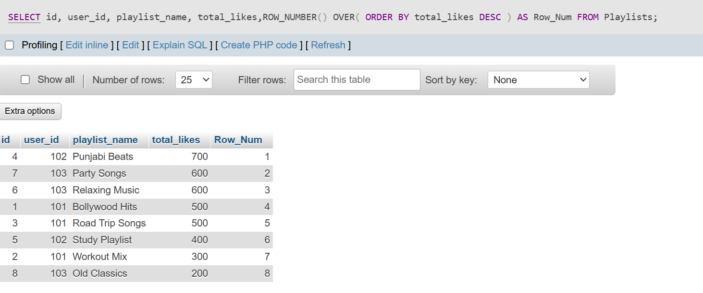
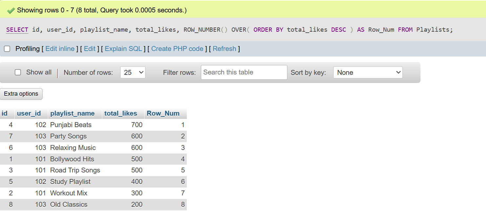
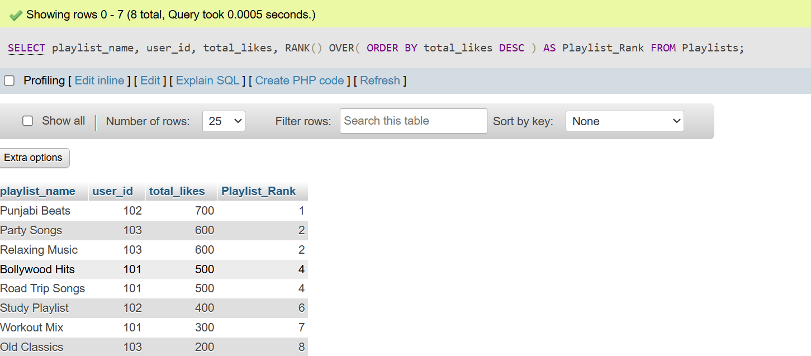
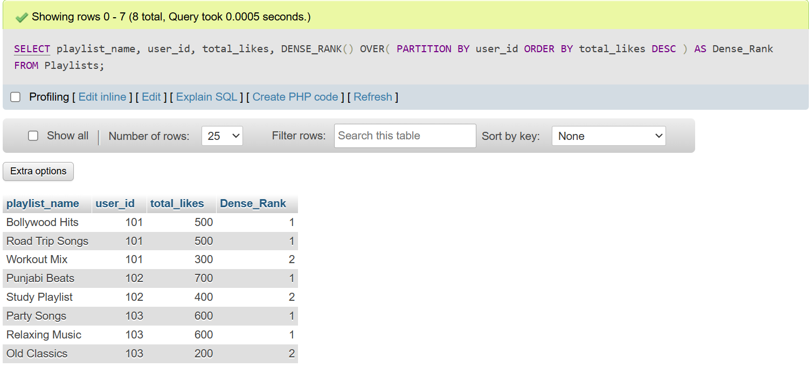
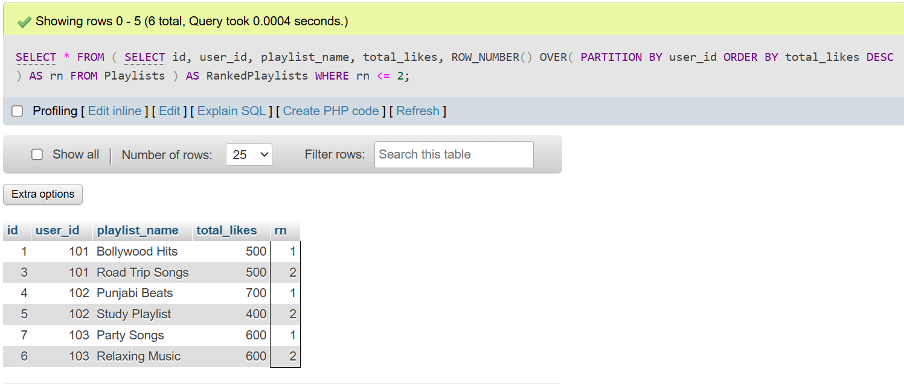

## <center><h1> SESSION - 13 : WINDOW FUNCTION - PART 1 </h1></center>

# TASK - 1: Create a table named Playlists with columns: id, user_id, playlist_name, and total_likes. Insert at least 8 sample rows with different users and playlists, making sure some playlists have the same user_id.

```
CREATE TABLE Playlists (
    id INT AUTO_INCREMENT PRIMARY KEY,
    user_id INT,
    playlist_name VARCHAR(100),
    total_likes INT
);

INSERT INTO Playlists VALUES
(NULL, 101, 'Bollywood Hits', 500),
(NULL, 101, 'Workout Mix', 300),
(NULL, 101, 'Road Trip Songs', 500),
(NULL, 102, 'Punjabi Beats', 700),
(NULL, 102, 'Study Playlist', 400),
(NULL, 103, 'Relaxing Music', 600),
(NULL, 103, 'Party Songs', 600),
(NULL, 103, 'Old Classics', 200);

SELECT id, user_id, playlist_name, total_likes,ROW_NUMBER() OVER( ORDER BY total_likes DESC ) AS Row_Num FROM Playlists;
```


# TASK - 2 : Write a SQL query using ROW_NUMBER() and the OVER() clause to assign a unique row number to each playlist, ordered by total_likes in descending order.

```
SELECT id, user_id, playlist_name, total_likes, ROW_NUMBER() OVER( ORDER BY total_likes DESC ) AS Row_Num FROM Playlists;
```


# TASK - 3 : Use the RANK() function with the OVER() clause to rank all playlists by total_likes, and display the playlist_name, user_id, total_likes, and their rank.

```
SELECT playlist_name, user_id, total_likes, RANK() OVER( ORDER BY total_likes DESC ) AS Playlist_Rank FROM Playlists;
```


# TASK- 4 :Write a SQL query using DENSE_RANK() and PARTITION BY user_id to rank each user's playlists by total_likes, showing playlist_name, user_id, total_likes, and dense rank.<br><br><em><strong>Hint:</strong> This will show how popular each playlist is within each user's account, similar to how Spotify might rank your top playlists.</em>

```
SELECT playlist_name, user_id, total_likes, DENSE_RANK() OVER( PARTITION BY user_id ORDER BY total_likes DESC ) AS Dense_Rank FROM Playlists;

```


# TASK- 5 : Imagine you want to show the top 2 playlists per user based on total_likes, like Spotify's 'Your Top Playlists' feature. Write a query using a window function to select only the top 2 playlists for each user.

```
SELECT * FROM ( SELECT id, user_id, playlist_name, total_likes, ROW_NUMBER() OVER( PARTITION BY user_id ORDER BY total_likes DESC ) AS rn FROM Playlists ) AS RankedPlaylists WHERE rn <= 2;
```
