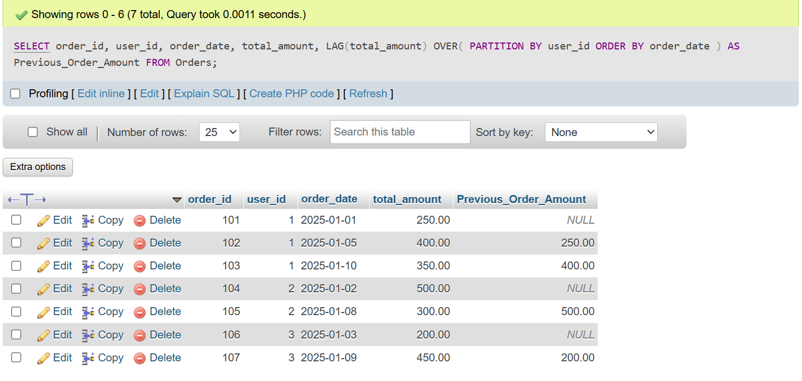
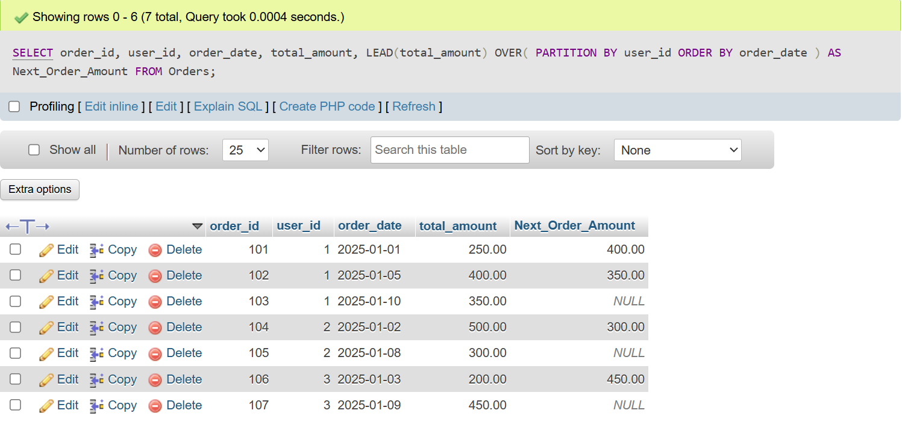
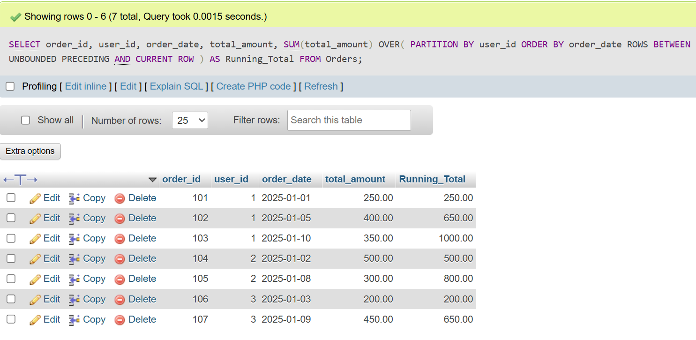
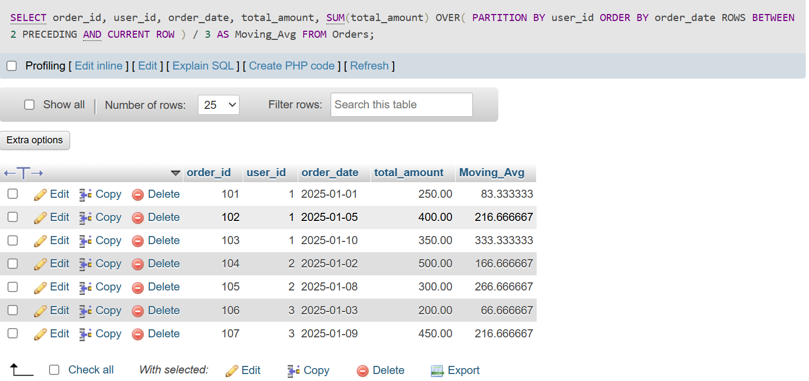

## <center><h1> SESSION - 14 : WINDOWS FUNCTION - PART 2 </h1></center>

# TASK - 1 : Create a table called Orders with columns: order_id, user_id, order_date, and total_amount. Insert at least 7 sample rows representing different users and dates, similar to how food orders appear in Zomato or Swiggy.

```
CREATE TABLE Orders (
    order_id INT PRIMARY KEY,
    user_id INT,
    order_date DATE,
    total_amount DECIMAL(10,2)
);

INSERT INTO Orders VALUES
(101, 1, '2025-01-01', 250),
(102, 1, '2025-01-05', 400),
(103, 1, '2025-01-10', 350),
(104, 2, '2025-01-02', 500),
(105, 2, '2025-01-08', 300),
(106, 3, '2025-01-03', 200),
(107, 3, '2025-01-09', 450);
```

# TASK - 2 : Write a SQL query using the LAG() function to show each user's order_id, order_date, and the total_amount of their previous order (if any), ordered by user and date.<br><br><em><strong>Hint:</strong> Use PARTITION BY user_id and ORDER BY order_date in your window function.</em>

```
SELECT order_id, user_id, order_date, total_amount, LAG(total_amount) OVER( PARTITION BY user_id ORDER BY order_date ) AS Previous_Order_Amount FROM Orders;
```


# TASK - 3 : Using the same Orders table, write a SQL query with the LEAD() function to display each order_id, order_date, and the next order's total_amount for the same user.

```
SELECT order_id, user_id, order_date, total_amount, LEAD(total_amount) OVER( PARTITION BY user_id ORDER BY order_date ) AS Next_Order_Amount FROM Orders;
```


# TASK - 4 : Write a SQL query to calculate the running total of total_amount for each user, showing order_id, order_date, total_amount, and a column running_total that accumulates the sum as you move through each user's orders.<br><br><em><strong>Hint:</strong> Use SUM(total_amount) OVER (PARTITION BY user_id ORDER BY order_date ROWS BETWEEN UNBOUNDED PRECEDING AND CURRENT ROW).</em>

```
SELECT order_id, user_id, order_date, total_amount, SUM(total_amount) OVER( PARTITION BY user_id ORDER BY order_date ROWS BETWEEN UNBOUNDED PRECEDING AND CURRENT ROW ) AS Running_Total FROM Orders;
```


# TASK - 5 : Write a SQL query to calculate a 3-order moving average of total_amount for each user, showing order_id, order_date, total_amount, and moving_avg columns.<br><br><em><strong>Constraint:</strong> Use SUM() OVER() with ROWS BETWEEN 2 PRECEDING AND CURRENT ROW to compute the moving average.</em>

```
SELECT order_id, user_id, order_date, total_amount, SUM(total_amount) OVER( PARTITION BY user_id ORDER BY order_date ROWS BETWEEN 2 PRECEDING AND CURRENT ROW ) / 3 AS Moving_Avg FROM Orders;
```
