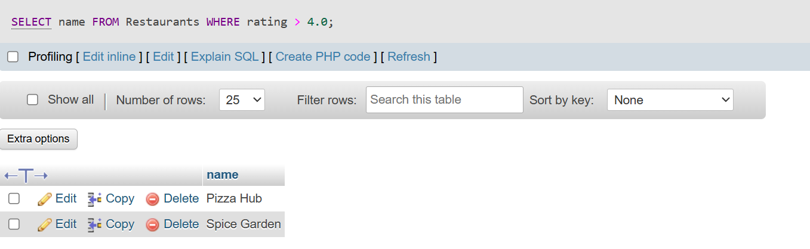
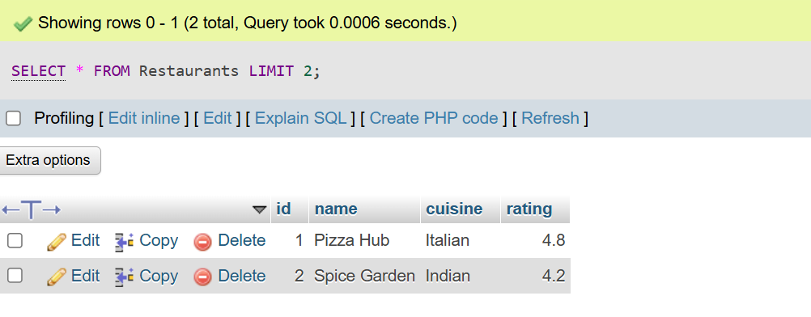
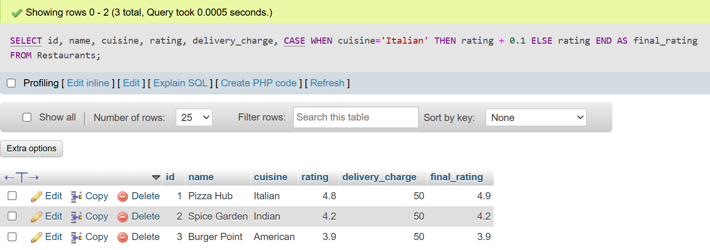
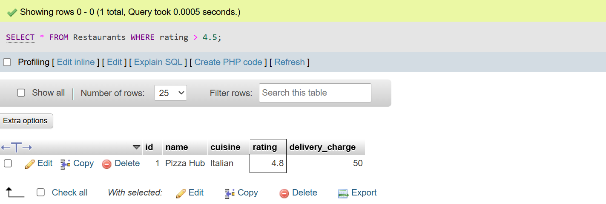

## <center><h1> SESSION - 15 : SQL INTEGRATION </h1></center>

# TASK - 1 :install the sqlite3 module in Python and write a script to create a new database called foodie.db with a table Restaurants (id, name, cuisine, rating).

```
CREATE TABLE Restaurants (
    id int AUTO_INCREMENT PRIMARY KEY,
    name VARCHAR(100),
    cuisine VARCHAR(50),
    rating DECIMAL(2,1)
);

INSERT INTO Restaurants VALUES
(null,'Pizza Hub','Italian',4.8),
(null,'Spice Garden','Indian',4.2),
(null,'Burger Point','American',3.9);
```


# TASK - 2 :  Using sqlite3 in Python, insert three sample restaurants into the Restaurants table in foodie.db and write a query to fetch all restaurants with a rating above 4.0, then print their names.

```
SELECT name FROM Restaurants WHERE rating > 4.0;
```


# TASK - 3 : Write Python code to load all rows from the Restaurants table in foodie.db into a Pandas DataFrame and display the top 2 rows using DataFrame.head().

```
SELECT * FROM Restaurants LIMIT 2;
```


# TASK - 4 :Add a new column 'delivery_charge' to your DataFrame, setting it to 50 for all restaurants, and then calculate a new column 'final_rating' as rating + (0.1 if cuisine is 'Italian').<br><br><em><strong>Hint:</strong> Use DataFrame.apply() or a lambda function for the conditional logic.</em>

```
ALTER TABLE Restaurants ADD COLUMN delivery_charge INT;

UPDATE Restaurants SET delivery_charge = 50;

SELECT id, name, cuisine, rating, delivery_charge, CASE WHEN cuisine='Italian' THEN rating + 0.1 ELSE rating END AS final_rating FROM Restaurants;
```


# TASK - 5 : Automate a daily summary: Write a Python script that connects to foodie.db, fetches all restaurants with rating above 4.5, loads them into a DataFrame, and saves the result as a CSV file named top_rated_restaurants.csv.

```
SELECT * FROM Restaurants WHERE rating > 4.5;
```
