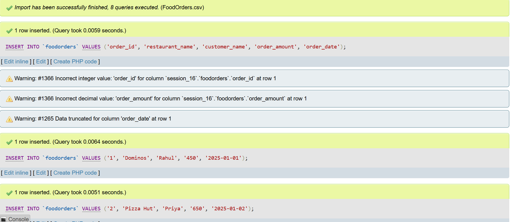
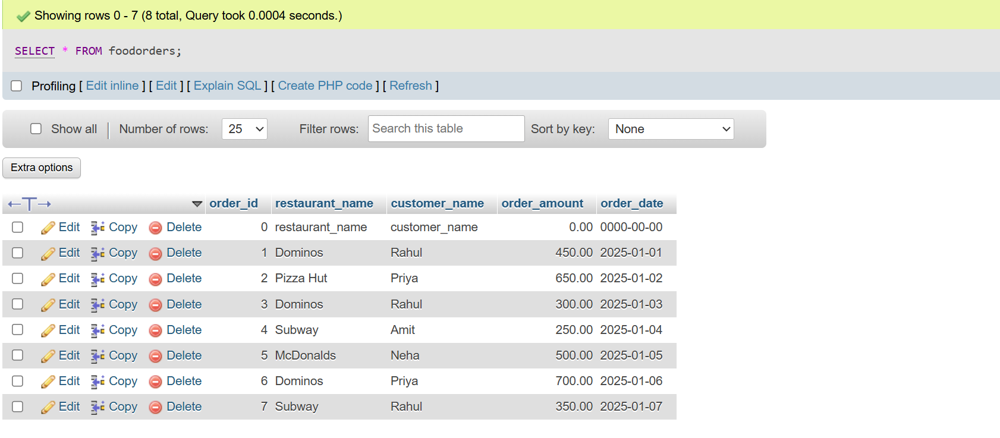
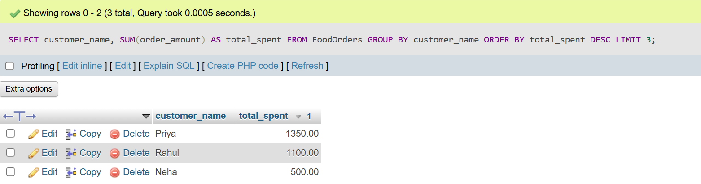
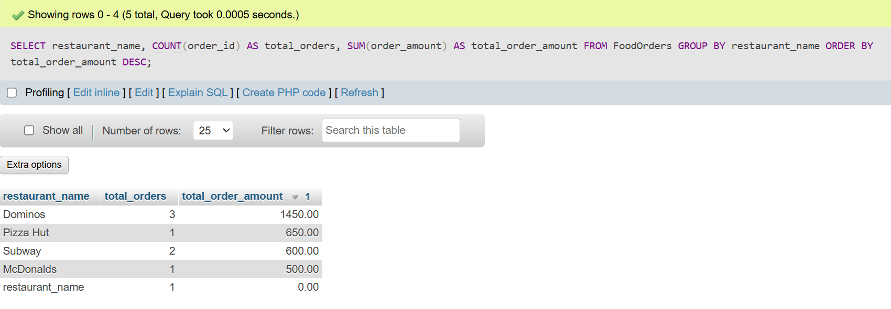
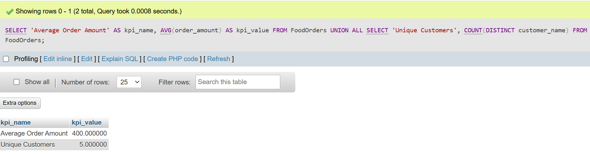

## <center><h1> SESSION - 16 : SQL PROJECT - SALES ANALYSIS </center></h1>

# task - 1 : Import a CSV file of food delivery orders (with columns like order_id, restaurant_name, customer_name, order_amount, order_date) into a new SQL table named FoodOrders using your database tool of choice.

```
CREATE TABLE FoodOrders (
    order_id INT PRIMARY KEY,
    restaurant_name VARCHAR(100),
    customer_name VARCHAR(100),
    order_amount DECIMAL(10,2),
    order_date DATE
);

>> IN NOTEPAD (CREATE CSV FILE): FoodOrders.csv

    order_id,restaurant_name,customer_name,order_amount,order_date
    1,Dominos,Rahul,450,2025-01-01
    2,Pizza Hut,Priya,650,2025-01-02
    3,Dominos,Rahul,300,2025-01-03
    4,Subway,Amit,250,2025-01-04
    5,McDonalds,Neha,500,2025-01-05
    6,Dominos,Priya,700,2025-01-06
    7,Subway,Rahul,350,2025-01-07
```
**STEPS TO IMPORT CSV FILE**
```
    1. Open phpMyAdmin
    2. Create database
    3. Run CREATE TABLE query
    4. Select FoodOrders table
    5. Click Import tab
    6. Choose FoodOrders.csv
    7. Click Go
```





# task - 2 : Write SQL statements to create a table called TopSongs with columns: song_id, song_title, artist, streams, and release_date, then insert at least 5 records representing popular tracks from Spotify.

```
CREATE TABLE TopSongs (
    song_id INT PRIMARY KEY,
    song_title VARCHAR(100),
    artist VARCHAR(100),
    streams BIGINT,
    release_date DATE
);

INSERT INTO TopSongs VALUES
(1,'Blinding Lights','The Weeknd',4200000000,'2019-11-29'),
(2,'Shape of You','Ed Sheeran',3900000000,'2017-01-06'),
(3,'As It Was','Harry Styles',2800000000,'2022-04-01'),
(4,'Someone You Loved','Lewis Capaldi',2900000000,'2019-05-17'),
(5,'Flowers','Miley Cyrus',2200000000,'2023-01-13');

SELECT * FROM TopSongs;
```


# task - 3 : Write an SQL query to find the top 3 customers who ordered the most from the FoodOrders table based on total order_amount, and display their names and total spent.

```
CREATE TABLE FoodOrders (
    order_id INT PRIMARY KEY,
    restaurant_name VARCHAR(100),
    customer_name VARCHAR(100),
    order_amount DECIMAL(10,2),
    order_date DATE
);

INSERT INTO FoodOrders VALUES
(1,'Dominos','Rahul',450,'2025-01-01'),
(2,'Pizza Hut','Priya',650,'2025-01-02'),
(3,'Dominos','Rahul',300,'2025-01-03'),
(4,'Subway','Amit',250,'2025-01-04'),
(5,'McDonalds','Neha',500,'2025-01-05'),
(6,'Dominos','Priya',700,'2025-01-06'),
(7,'Subway','Rahul',350,'2025-01-07');

SELECT customer_name,SUM(order_amount) AS total_spent FROM FoodOrders GROUP BY customer_name ORDER BY total_spent DESC LIMIT 3;
```


# task - 4 :Generate a product performance report by writing an SQL query that lists each restaurant_name from FoodOrders, the number of orders, and the total order_amount, ordered by total order_amount descending.<br><br><em><strong>Hint:</strong> Use GROUP BY and ORDER BY clauses.</em>

```
SELECT restaurant_name, COUNT(order_id) AS total_orders, SUM(order_amount) AS total_order_amount FROM FoodOrders GROUP BY restaurant_name ORDER BY total_order_amount DESC;
```


# task - 5 : Create an SQL query that calculates two KPIs for the FoodOrders table: (1) average order_amount and (2) total number of unique customers, and format the output for dashboard display (two columns: kpi_name, kpi_value).

```
SELECT 'Average Order Amount' AS kpi_name, AVG(order_amount) AS kpi_value FROM FoodOrders UNION ALL SELECT 'Unique Customers', COUNT(DISTINCT customer_name) FROM FoodOrders;
```
