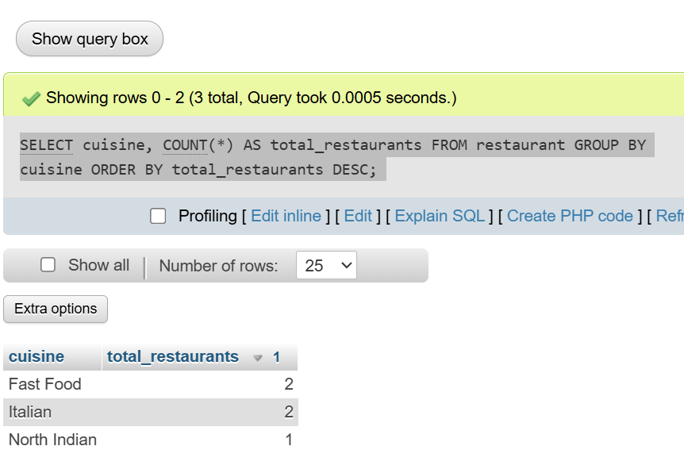
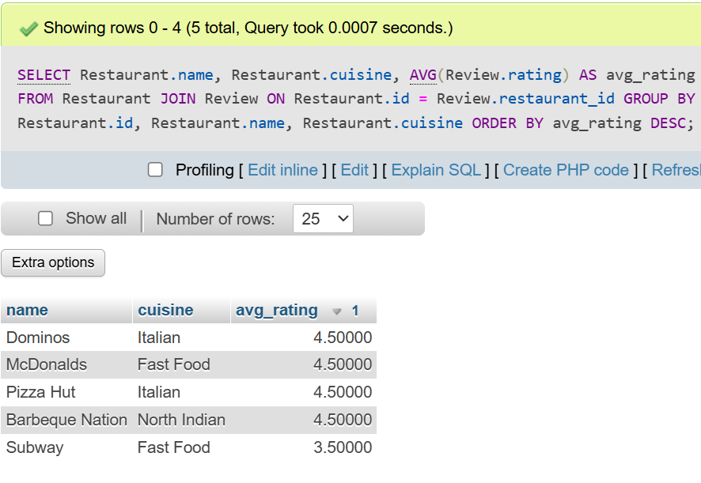
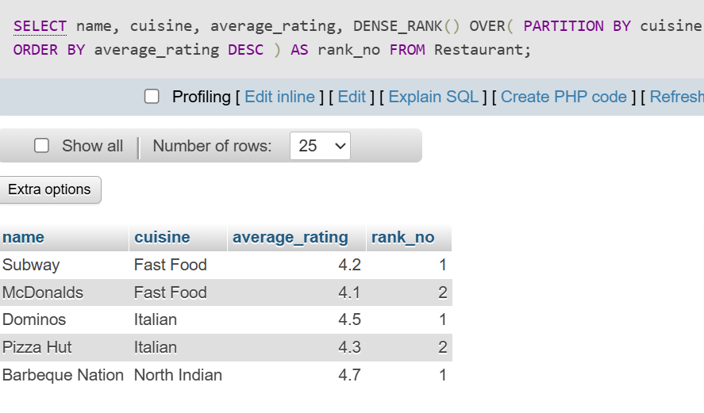

## <center><h1> session - 17 : SQL PROJECT - HR ANALYSIS </h1></center>

# TASK - 1 : Create a SQL table called Restaurant with columns: id, name, cuisine, location, and average_rating. Insert at least 5 sample rows representing popular restaurants from Zomato.

```
CREATE TABLE Restaurant (
    id INT  AUTO_INCREMENT PRIMARY KEY,
    name VARCHAR(100),
    cuisine VARCHAR(50),
    location VARCHAR(100),
    average_rating DECIMAL(2,1)
);

INSERT INTO Restaurant VALUES
(null,'Dominos','Italian','Ahmedabad',4.5),
(null,'Pizza Hut','Italian','Rajkot',4.3),
(null,'Subway','Fast Food','Surat',4.2),
(null,'Barbeque Nation','North Indian','Ahmedabad',4.7),
(null,'McDonalds','Fast Food','Vadodara',4.1);
```


# task - 2 : Write a SQL query to generate a report showing the number of restaurants for each cuisine type from your Restaurant table, ordered by the count in descending order.<br><br><em><strong>Hint:</strong> Use GROUP BY and ORDER BY.</em>

```
SELECT cuisine, COUNT(*) AS total_restaurants FROM restaurant GROUP BY cuisine ORDER BY total_restaurants DESC;
```


# task - 3 : Add a new table called Review with columns: id, restaurant_id, user_name, rating, and review_date. Insert at least 10 sample reviews, linking them to restaurants using restaurant_id.

```
CREATE TABLE Review (
    id INT PRIMARY KEY,
    restaurant_id INT,
    user_name VARCHAR(100),
    rating DECIMAL(2,1),
    review_date DATE,
    FOREIGN KEY (restaurant_id)
    REFERENCES Restaurant(id)
);

INSERT INTO Review VALUES (1,1,'Rahul',5,'2025-01-01'), (2,1,'Priya',4,'2025-01-02'), (3,2,'Amit',4,'2025-01-03'), (4,2,'Neha',5,'2025-01-04'), (5,3,'Karan',4,'2025-01-05'), (6,3,'Riya',3,'2025-01-06'), (7,4,'Jay',5,'2025-01-07'), (8,4,'Pooja',4,'2025-01-08'), (9,5,'Vikas',4,'2025-01-09'), (10,5,'Sneha',5,'2025-01-10');
```

# task - 4 : Write a SQL query using a JOIN to display each restaurant's name, cuisine, and its average review rating (from the Review table), ordered by highest average rating first.<br><br><em><strong>Hint:</strong> Use JOIN and GROUP BY with aggregate functions.</em>

```
SELECT Restaurant.name, Restaurant.cuisine, AVG(Review.rating) AS avg_rating FROM Restaurant JOIN Review ON Restaurant.id = Review.restaurant_id GROUP BY Restaurant.id, Restaurant.name, Restaurant.cuisine ORDER BY avg_rating DESC;
```


# task - 5 : Use a window function to rank restaurants by their average review rating within each cuisine type, showing the restaurant name, cuisine, average rating, and rank.<br><br><em><strong>Hint:</strong> Use the RANK() or DENSE_RANK() window function partitioned by cuisine.</em>

```
SELECT name, cuisine, average_rating, DENSE_RANK() OVER( PARTITION BY cuisine ORDER BY average_rating DESC ) AS rank_no FROM Restaurant;
```
