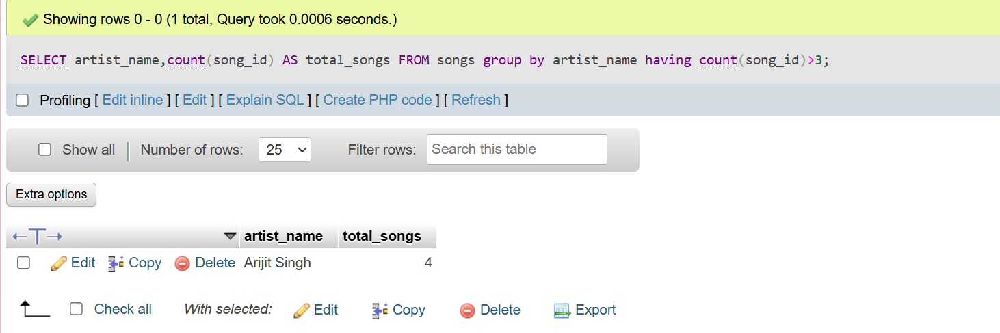
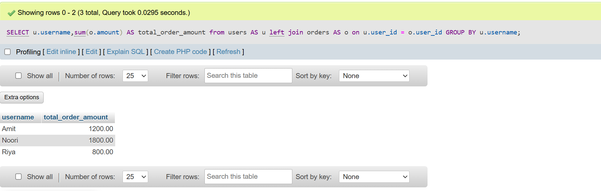
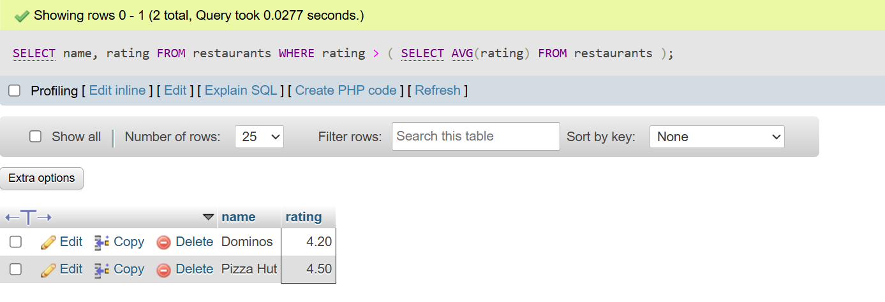

## <center><h1> SESSION - 18 : INTERVIEW QUESTION + FINAL REVISION </h1></center>

# TASK - 1 : Write an SQL query to display the total number of songs uploaded by each artist from a table 'songs' (columns: song_id, artist_name, title) and show only those artists who have uploaded more than 3 songs.

```
CREATE TABLE songs (
    song_id INT PRIMARY KEY AUTO_INCREMENT,
    artist_name VARCHAR(100),
    title VARCHAR(100)
);

INSERT INTO songs (artist_name, title) VALUES
('Arijit Singh', 'Tum Hi Ho'),
('Arijit Singh', 'Channa Mereya'),
('Arijit Singh', 'Kesariya'),
('Arijit Singh', 'Phir Mohabbat'),
('Shreya Ghoshal', 'Teri Meri'),
('Shreya Ghoshal', 'Sun Raha Hai'),
('Shreya Ghoshal', 'Deewani Mastani'),
('Armaan Malik', 'Bol Do Na Zara'),
('Armaan Malik', 'Main Rahoon Ya Na Rahoon'),
('Armaan Malik', 'Control');

select artist_name , count(song_id) from songs group by artist_name having count(song_id)>3;
```


# TASK - 2 : Given two tables, 'orders' (order_id, user_id, amount) and 'users' (user_id, username), write a SQL JOIN query to display each username along with their total order amount.

```
CREATE TABLE users (
    user_id INT PRIMARY KEY,
    username VARCHAR(50)
);

CREATE TABLE orders (
    order_id INT PRIMARY KEY,
    user_id INT,
    amount DECIMAL(10,2),
    FOREIGN KEY (user_id) REFERENCES users(user_id)
);


INSERT INTO users (user_id, username) VALUES
(1, 'Noori'),
(2, 'Amit'),
(3, 'Riya');


INSERT INTO orders (order_id, user_id, amount) VALUES
(101, 1, 500),
(102, 1, 700),
(103, 2, 1200),
(104, 3, 800),
(105, 1, 600);

SELECT u.username,sum(o.amount) AS total_order_amount from users AS u left join orders AS o on u.user_id = o.user_id GROUP BY u.username ;
```


# TASK - 3 :Write a SQL subquery to find the names of all restaurants from a 'restaurants' table (id, name, rating) whose rating is higher than the average rating of all restaurants.

```
CREATE TABLE restaurants (
    id INT PRIMARY KEY AUTO_INCREMENT,
    name VARCHAR(100),
    rating DECIMAL(3,2)
);

INSERT INTO restaurants (name, rating) VALUES
('Dominos', 4.2),
('Subway', 3.8),
('Pizza Hut', 4.5),
('Burger King', 3.9),
('KFC', 4.1);

SELECT name, rating
FROM restaurants
WHERE rating > (
    SELECT AVG(rating)
    FROM restaurants
);
```


# TASK - 4 : Using a 'transactions' table (id, user_id, amount, transaction_date), write a SQL query with a window function to display each user's transaction amount and their running total (cumulative sum) ordered by transaction_date.

```
    CREATE TABLE transactions (
    id INT PRIMARY KEY,
    user_id INT,
    amount DECIMAL(10,2),
    transaction_date DATE
    );

    INSERT INTO transactions (id, user_id, amount, transaction_date) VALUES
    (1, 101, 500.00, '2024-01-01'),
    (2, 101, 300.00, '2024-01-05'),
    (3, 101, 200.00, '2024-01-10'),
    (4, 102, 400.00, '2024-01-02'),
    (5, 102, 100.00, '2024-01-08');

    SELECT
    user_id,
    transaction_date,
    amount,
    SUM(amount) OVER (
    PARTITION BY user_id
    ORDER BY transaction_date
    ) AS running_total
    FROM transactions;
```