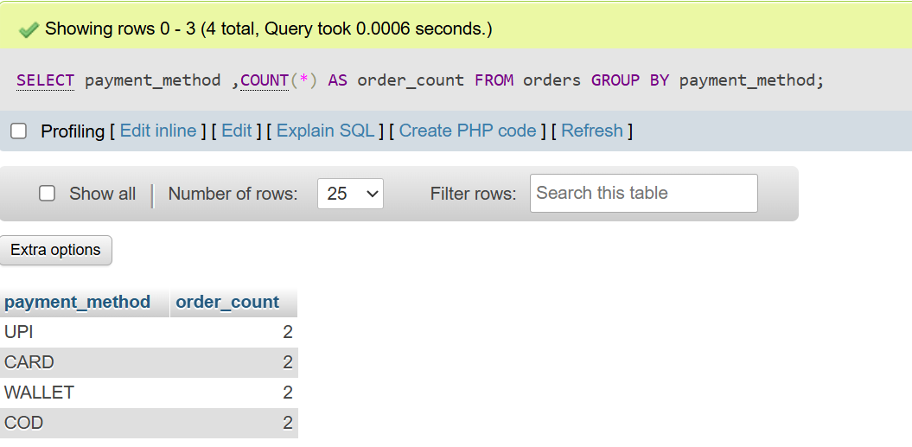
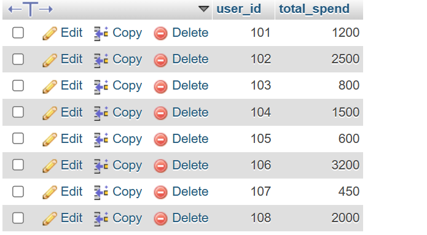
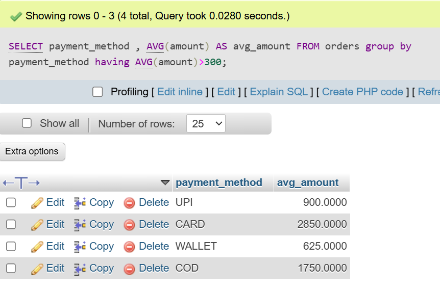
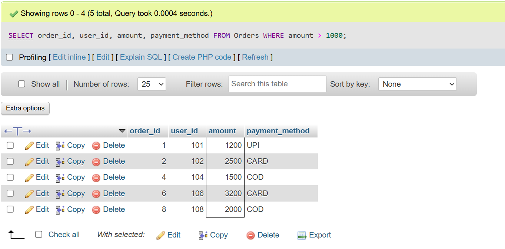
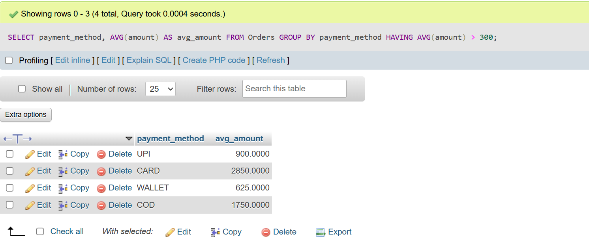

## <center><h1> session - 8 : GROUOP BY + HAVING </h1></center>

# TASK - 1 :Create a table called Orders with columns: order_id, user_id, payment_method, and amount. Insert at least 8 sample records representing different users and payment methods (like UPI, Card, Wallet, COD).

```
create table orders (
    order_id int AUTO_INCREMENT PRIMARY KEY,
    user_id bigint,
    payment_method enum('UPI','CARD','WALLET','COD'),
    amount bigint
    );
```
<h2><u>sample records :</u></h2>

```
insert into orders(user_id,payment_method,amount)VALUES
(101, 'UPI', 1200),
(102, 'CARD', 2500),
(103, 'WALLET', 800),
(104, 'COD', 1500),
(105, 'UPI', 600),
(106, 'CARD', 3200),
(107, 'WALLET', 450),
(108, 'COD', 2000);
```

# TASK - 2 : Write an SQL query to count how many orders were placed using each payment_method in the Orders table, similar to how Zomato shows payment breakdown in analytics.

```
SELECT payment_method ,COUNT(*) AS order_count FROM orders GROUP BY payment_method ;
```


# TASK - 3 : Write an SQL query to find the total amount spent by each user_id in the Orders table. Display user_id and their total spend.

```
SELECT user_id, SUM(amount) AS total_spend
FROM Orders
GROUP BY user_id;
```


# TASK - 4 : Write an SQL query to show only those payment methods where the average order amount is greater than 300, using GROUP BY and HAVING.<br><br><em><strong>Hint:</strong> Use AVG(amount) in your HAVING clause.</em>

```
SELECT payment_method , AVG(amount) AS avg_amount  FROM orders group by payment_method having AVG(amount)>300;
```


# TASK - 5 : Explain the difference between WHERE and HAVING by giving one example query for each, using the Orders table. Your examples should show a scenario where WHERE and HAVING filter different things.

<h2><u>DIFFERENCE BETWEEN WHERE & HAVING BY </u></h2>

- <b>WHERE</b> : Filters Rows Before Grouping.
- <b>HAVING</b> : filter Goups After Aggregation.

<h2><u>1.EXAMPLE WITH WHERE</u></h2>

<U>Show only orders above ₹1000</U>
 ``` 
 SELECT order_id, user_id, amount, payment_method FROM Orders WHERE amount > 1000;
 ```
 

 <h2><u>2.EXAMPLE WITH HAVING </u></h2>

<U>Show payment methods where average order amount > 300</U>
```
SELECT payment_method, AVG(amount) AS avg_amount FROM Orders GROUP BY payment_method HAVING AVG(amount) > 300;
```
