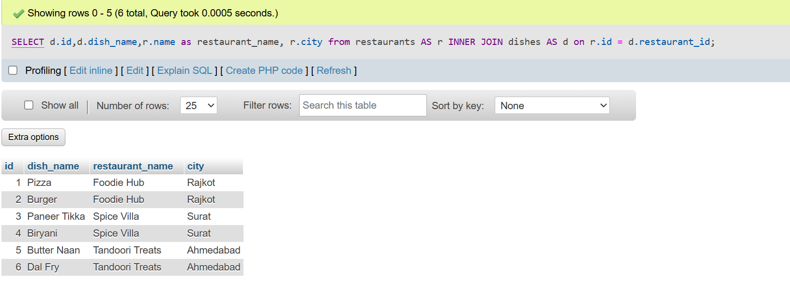
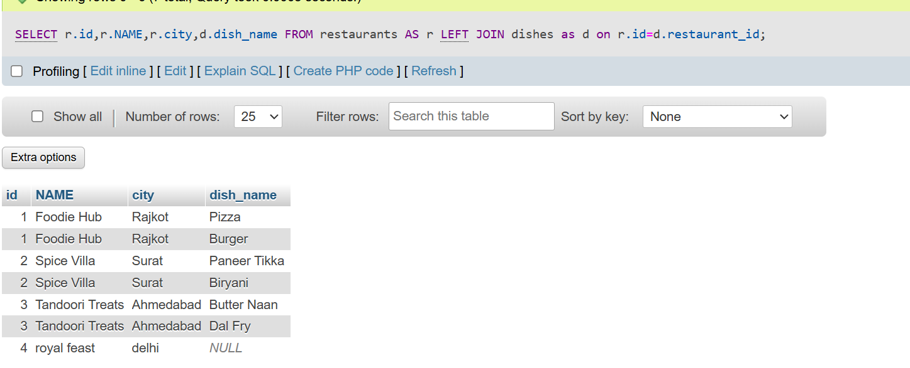
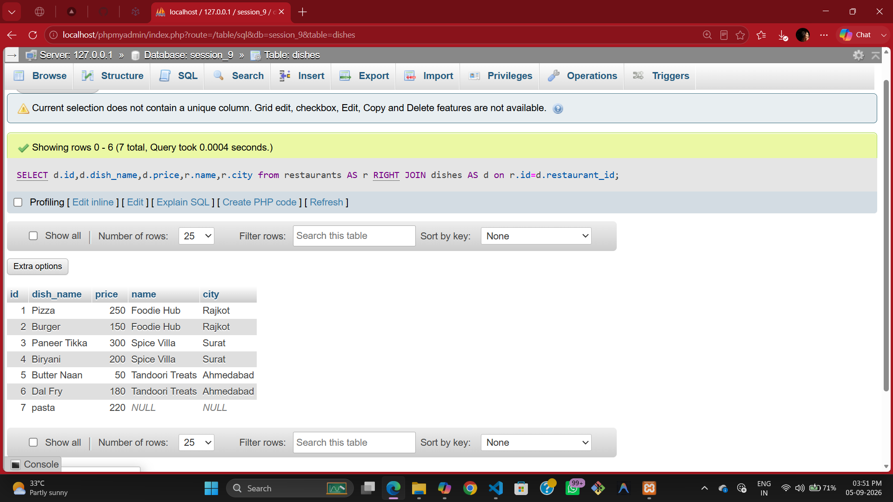

# <center><h1> SESSSION - 9 : JOINS - PART - 1 </h1></center>

## TASK - 1 : Create two tables in your database: 'restaurants' (id, name, city) and 'dishes' (id, restaurant_id, dish_name, price). Insert at least 3 restaurants and 2-3 dishes for each restaurant. 

```
create table restaurants (
     id int AUTO_INCREMENT PRIMARY KEY,
    NAME varchar(255),
    city varchar(20)
    );

create table dishes(
    id int AUTO_INCREMENT PRIMARY KEY,
    restaurant_id int,
    dish_name varchar(50),
    price int 
     FOREIGN KEY (restaurant_id) REFERENCES restaurants(id)
   );

INSERT INTO restaurants VALUES
(1, 'Foodie Hub', 'Rajkot'),
(2, 'Spice Villa', 'Surat'),
(3, 'Tandoori Treats', 'Ahmedabad');
(4,'royal feast','delhi')

INSERT INTO dishes VALUES
(1, 1, 'Pizza', 250),
(2, 1, 'Burger', 150),
(3, 2, 'Paneer Tikka', 300),
(4, 2, 'Biryani', 200),
(5, 3, 'Butter Naan', 50),
(6, 3, 'Dal Fry', 180);
```
# TASK - 2 : Write an SQL INNER JOIN query to display each dish along with its restaurant name and city, similar to how Zomato shows dish details with the restaurant info.

```
SELECT d.id,d.dish_name,r.name as restaurant_name, r.city from restaurants AS r INNER JOIN dishes AS d on r.id = d.restaurant_id;
```


# TASK - 3 : Write an SQL LEFT JOIN query to list all restaurants and their dishes, showing restaurants even if they currently have no dishes on the menu.<br><br><em><strong>Hint:</strong> Use LEFT JOIN so restaurants without dishes still appear in the results with NULL for dish columns.</em>

```
SELECT r.id,r.NAME,r.city,d.dish_name FROM restaurants AS r LEFT JOIN dishes as d on r.id=d.restaurant_id;
```


# TASK - 4 : Write an SQL RIGHT JOIN query to display all dishes and their restaurant names, including any dishes that might not be linked to a restaurant (simulate a data error where a dish has a restaurant_id that doesn't match any restaurant).

```
SELECT d.id,d.dish_name,d.price,r.name,r.city from restaurants AS r RIGHT JOIN dishes AS d on r.id=d.restaurant_id;
```


# TASK - 5 : Given this scenario: You want to show a list of all playlists and the songs inside them, like Spotify. Explain which JOIN type (INNER, LEFT, or RIGHT) you would use to show all playlists, even if some are empty, and write the SQL query for it.

- use **left join** 
    - **reason** : You Want To Show All Playlists,Even If Some Have No songs.LEFT JOIN keeps Every Row From The Left Table (Playlists) And Fills fills in **NULL** For Songs If None Exist.

```
    SELECT p.playlist_name, s.song_title FROM playlists p LEFT JOIN songs s ON p.id = s.playlist_id;
```    